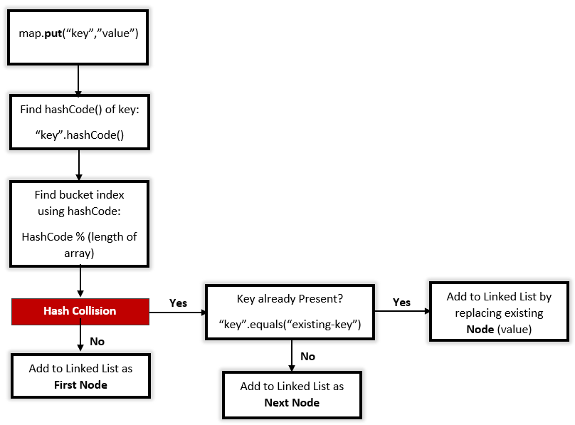
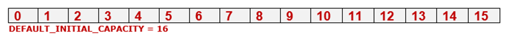
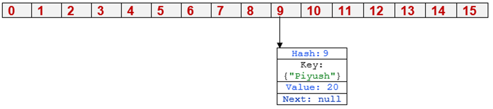
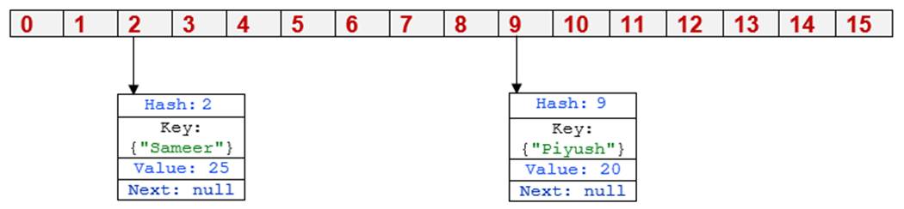
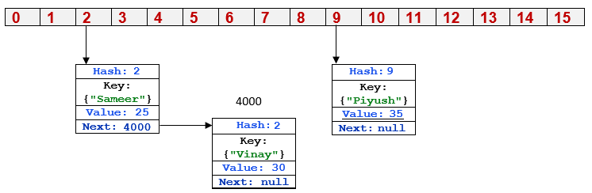

# HashMap    

> A HashMap is a data structure that is used to store and retrieve values based on keys.
> Backing data structure - **Hash Table + Array**

* **Fast access time**: HashMaps provide constant time access to elements, which means that **retrieval** and **insertion** of elements are very fast, usually **O(1) time complexity**.
* **Allow duplicate Values**: HashMaps allow for duplicate values, but not duplicate keys. 
If a duplicate key is added, the previous **value** associated with the key is **overwritten**.
* **Null Insertion Allowed** : Allows 1 null key and many null values: This means that a null key can be used to store a value, and a null value can be associated with a key.
* **Ordered not followed**: HashMaps are not ordered, which means that the order in which elements are added to the map is not preserved. However, LinkedHashMap is a variation of HashMap that preserves the insertion order.
* **Uses hashing function**: HashMaps uses a hash function to **map keys to indices in an array**. 
This allows for a **quick lookup** of values based on keys.
* Stores **key-value pairs**: Each element in a HashMap consists of a key-value pair. 
The key is used to look up the associated value.
* **Thread-unsafe** or **Non-synchronized**: HashMaps are not thread-safe, which means that if multiple threads access the same hashmap simultaneously, it can lead to data inconsistencies. 
If thread safety is required, ConcurrentHashMap can be used.
* Use `Collections.synchronizedMap(new HashMap())` to get synchronized HashMap.
* Implements **Serializable** and **Cloneable** interfaces.
* **Capacity and load factor**: HashMaps have a capacity, which is the number of elements that it can hold, and a **load factor**, which is the measure of how full the hashmap can be before it is resized.
* The initial default capacity of HashMap is 16, and default load factor is 0.75.
* When HashMap elements count exceed this threshold, HashMap is resized and new capacity is double the previous capacity.
> Threshold = (DEFAULT_LOAD_FACTOR * DEFAULT_INITIAL_CAPACITY).
* Best Choice: **Fast retrieval**

### Hashing
 
* Hashing is a process of converting an object into integer form by using the method hashCode(). 
* It’s necessary to write the hashCode() method properly for better performance of HashMap. 
> HashMap also allows a **null** key, so **hash code of null will always be 0**.

### `hashCode() `

* `hashCode()` is used to get the hash code of an object. 
* Returns the memory reference of an object in integer form. 
* Definition of `hashCode()` is `public native hashCode()`. It indicates the implementation of `hashCode()` is native because there is not any direct method in java to fetch the reference of the object. 
* It is possible to provide your implementation of `hashCode()`.  
* In HashMap, `hashCode()` is used to calculate the `bucket index`. 
	
### `equals()` 
* Used to check whether 2 objects are equal or not provided by the Object class.  
* You can override this in your class to provide your implementation.  
* HashMap uses `equals()` to **compare** the **key** to whether they are equal or not.  
* If the `equals()` method return true, they are equal otherwise not equal. 

```java
public Employee(String name){
    this.name = name;
}

@Override
public boolean equals(Object o) {
    if (this == o) return true;
    if (o == null || getClass() != o.getClass()) return false;
    Employee employee = (Employee) o;
    return Objects.equals(name, employee.name);
}

@Override
public int hashCode() {
    return Objects.hash(name); // calls native hashCode()
}
```

[Contract between hashCode() and equals()](contract_between_hashCode_and_equals.md)

### Buckets
* Bucket is one element of the HashMap array. 
* It is used to **store nodes**. 
* Two or more nodes can have the same bucket. 
* In that case, a `LinkedList` structure is used to connect the nodes. 
* Buckets are different in capacity.
* A single bucket can have more than one node, it depends on the `hashCode()` method.
* The better your `hashCode()` is, the better your buckets will be utilized.
> Capacity = number of buckets * load factor

### Hash (Index) Calculation in HashMap

* The Hash code of the key may be large enough to create an array. 
* Hash code generated may be in the range of integer and if we create arrays for such a range, then it will easily cause `outOfMemoryException`. 
* So we generate an index to minimize the size of the array.

 The following operation is performed to calculate the index. 
>Index = hashCode(key) % number of bucket

>_WARNING_! if the hashing function is not properly implemented or if the load factor is too high, the performance of a HashMap can degrade.

### Rehash Threshold 
* **Rehashing**: The process of doubling the capacity of the HashMap after it reaches its Threshold.
* It is the product of Load Factor and Initial Capacity.
* In java, by default, it is (16 * 0.75 = 12). 
* That is, Rehashing takes place after inserting 12 key-value pairs into the HashMap.

> **TREEIFY_THRESHOLD** : From Java 8 onward, Java has started using Self Balancing BST instead of a linked list for chaining. The advantage of self-balancing bst is, we get the worst case (when every key maps to the same slot) search time is O(Log n).

### Constructor of a HashMap
      HashMap()
      HashMap(int initialCapacity)
      HashMap(int initialCapacity, float loadFactor)
      HashMap(Map map)

## Methods of HashMap

| **Method**                                                                             | **Description**                                                                                                                                                                             |
|----------------------------------------------------------------------------------------|---------------------------------------------------------------------------------------------------------------------------------------------------------------------------------------------|
| clear()                                                                                | **Removes** all of the mappings from this map.                                                                                                                                              |
| clone()                                                                                | Returns a **shallow copy** of this HashMap instance: the **keys** and **values themselves are not cloned**.                                                                                 |
| compute(K key, BiFunction<? super K,? super V,? extends V> remappingFunction)          | Attempts to **compute a mapping** for the **specified key** and its **current mapped value** (or **null** if there is no current mapping).                                                  |
| computeIfAbsent(K key, Function<? super K,? extends V> mappingFunction)                | If the specified key is not already associated with a value (or is mapped to null), attempts to compute its value using the given mapping function and enters it into this map unless null. |
| computeIfPresent(K key, BiFunction<? super K,? super V,? extends V> remappingFunction) | If the value for the specified key is present and non-null, attempts to compute a new mapping given the key and its current mapped value.                                                   |
| containsKey(Object key)                                                                | Returns true if this map contains a mapping for the specified key.                                                                                                                          |
| containsValue(Object value)                                                            | Returns true if this map maps one or more keys to the specified value.                                                                                                                      |
| entrySet()                                                                             | Returns a Set view of the mappings contained in this map.                                                                                                                                   |
| get(Object key)                                                                        | Returns the value to which the specified key is mapped or null if this map contains no mapping for the key.                                                                                 |
| isEmpty()                                                                              | Returns true if this map contains no key-value mappings.                                                                                                                                    |
| keySet()                                                                               | Returns a Set view of the keys contained in this map.                                                                                                                                       |
| merge(K key, V value, BiFunction<? super V,? super V,? extends V> remappingFunction)   | "If the specified key is not already associated with a value or is associated with null, associate it with the given non-null value.                                                        |
| put(K key, V value)                                                                    | Associates the specified value with the specified key in this map.                                                                                                                          |
| putAll(Map<? extends K,? extends V> m)                                                 | Copies all of the mappings from the specified map to this map.                                                                                                                              |
| remove(Object key)                                                                     | **Removes the mapping** for the specified **key** from this map if present.                                                                                                                         |
| size()                                                                                 | Returns the **number of key-value mappings** in this map.                                                                                                                                       |
| values()                                                                               | Returns a **Collection view of the values** contained in this map.                                                                                                                              |

### HashMap Operations
| **Method**         | **Key Exist** | **Key Not-Exist** |
|--------------------|---------------|-------------------|
| **put(k,v)**       | update        | insert            |
| **get(k)**         | value         | null              |
| **containsKey(k)** | TRUE          | FALSE             |
| **remove(k)**      | value         | null              |
| **size**           | size          | -1                |
| **keyset**         | ArrayList<k>  | null              |

# Internal working of a HashMap

### Initially Empty HashMap


* Here, the HashMap’s initial capacity is taken as 16. 
> CAPACITY as bucket size.

> Size of the empty Hashmap is Zero

```java
static final int DEFAULT_INITIAL_CAPACITY = 1 << 4;

Map<Employee, Integer> hashMap = new HashMap<>();
System.out.println("Size of an Empty HashMap: " + hashMap.size()); // 0
```


### Inserting Key-Value Pair
* Putting one key-value pair in the above HashMap
```java
Employee employee1 = new Employee("Piyush");
hashMap.put(employee1, 20);
```
#### Output:
    System.out.println(employee1.hashCode()); // -1903944663
    System.out.println(Math.abs(employee1.hashCode()) % 16); // 9

Steps:
1. Calculate hash code of Employee {“Piyush”}. It will be generated as -1903944663.
2. Calculate index by using index method it will be 9.
3. Create a node object as:
```java
{   
    int hash = 9;
    // {"Piyush"} is not a string but an object of class Employee
    Employee key = {"Piyush"};
    Integer value = 20;
    Node next = null;
}
```
4. Place this object at index 9, if no other object is presented there.



### Inserting another Key-Value Pair
* Now, putting the other pair, if no other object is present there.

```java
Employee employee2 = new Employee("Sameer");
hashMap.put(employee2, 25);
```
#### Output:
    System.out.println(employee2.hashCode()); // -1825818670
    System.out.println(Math.abs(employee2.hashCode()) % 16); // 2

Steps:
1. Calculate hash code of Employee {“Sameer”}. It will be generated as -1825818670.
2. Calculate index by using index method it will be 2.
3. Create a node object as:
```java
{ 
    int hash = 2;
    Employee key = {"Sameer"};
    Integer value = 25;
    Node next = null;
}
```
4. Place this object at index 2, if no other object is present there.



### In Case of collision: Different key
* Now, putting the other pair index 6, if no other object is presented there.

```java
Employee employee3 = new Employee("Vinay");
hashMap.put(employee3, 30);
```
#### Output:
    System.out.println(employee3.hashCode()); // 82659730
    System.out.println(Math.abs(employee3.hashCode()) % 16); // 2

Steps:
1. Calculate hash code of Employee {“Vinay”}. It will be generated as 82659730. 
2. Calculate index by using index method it will be 2. 
3. Create a node object as:
```java
{
    int hash = 2;
    Employee key = {"Vinay"};
    Integer value = 30;
    Node next = null;
}
```
4. Place this object at index 2, if no other object is present there.
5. In this case, a node object is found at index 2 – this is a case of **collision**.
   1. In that case, check via the hashCode() and equals() method if both the keys are the same. 
   2. If keys are the same, replace the value with the current value.
   3. Otherwise, connect this node object to the previous node object via linked list and both are stored at index 2. (Satisfied this case)


### In Case of collision: Same key
* Now, putting the other pair index 6, if no other object is presented there.
```java
Employee employee4 = new Employee("Piyush");
hashMap.put(employee4, 35);
```
#### Output:
    System.out.println(employee4.hashCode()); // -1903944663
    System.out.println(Math.abs(employee3.hashCode()) % 16); // 9

Steps:
1. Calculate hash code of Employee {“Piyush”}. It will be generated as -1903944663.
2. Calculate index by using index method it will be 9.
3. Create a node object as:
```java
{
    int hash = 9;
    Employee key = {"Piyush"};
    Integer value = 35;
    Node next = null;
}
```
4. Place this object at index 9, if no other object is presented there.
5. In this case, a node object is found at index 9 – this is a case of collision. 
6. In that case, check via the hashCode() and equals() method if both the keys are the same. 
   1. If keys are the same, replace the value with the current value. (Satisfied this case)



### Index Using the get():

* get(“key”) method is used to get a value by its key. 
* If you don’t know the key then it is not possible to fetch a value. presented

Fetch the data for key: “Piyush”

```java
System.out.println(hashMap.get(new Employee("Piyush"))); // 35
```
Steps:
* Calculate hash code of Key {“Piyush”}. It will be generated as -1903944663.
* Calculate index by using index method it will be 9.
* Go to index 9 of the array and compare the first element’s key with the given key.
* If both are equals then return the value, otherwise, check for the next element if it exists.
* In our case, it is found as the first element and the returned value is 35


Fetch the data for key: “Vinay”
```java
System.out.println(hashMap.get(new Employee("Vinay"))); // 30
```
Steps:
* Calculate hash code of Key {“Vinay”}. It will be generated as 82659730.
* Calculate index by using index method it will be 2.
* Go to index 2 of the array and compare the first element’s key with the given key.
* If both are equals then return the value, otherwise, check for the next element if it exists.
* In our case, it is not found as the first element and the next node object is not null.
* If the next node is null then return null.
* If the next of node is not null traverse to the second element and repeat process 3 until the key is not found or next is not null.
* When getting an object with its key, the linked list is traversed until the key matches or null is found on the next field.
* Time complexity is almost constant for the put and the get method until rehashing is not done.

## Improvements of Hash Collision / hash function is not distributing keys properly after Java 8:

* Hash collision degrades the performance of HashMap significantly. 
* Hash collisions have negative impact on the lookup time of HashMap. 
* When multiple keys end up in the same bucket, then values along with their keys are placed in a linked list. 
* In case of retrieval, linked list has to be traversed to get the entry.
* In worst case scenario, when all keys are mapped to the same bucket, the lookup time of HashMap increases from O(1)  O(n).

### Java 8 improvements/changes of HashMap objects in case of high collisions:
* The alternative String hash function added in Java 7 has been removed.
* Buckets containing a large number of colliding keys will store their entries in a balanced red black tree instead of a linked list after certain `TREEIFY_THRESHOLD` is reached.
* `TREEIFY_THRESHOLD` When a single bucket reaches this (and the total number exceeds `MIN_TREEIFY_CAPACITY`), it is transformed into a perfectly balanced red black tree node.
* `MIN_TREEIFY_CAPACITY` is the minimum number of buckets before a certain bucket is transformed into a Tree.
```java
static final int TREEIFY_THRESHOLD = 8;
static final int MIN_TREEIFY_CAPACITY = 64;
```
* Above changes ensure performance of O(log(n)) in worst case scenarios (hash function is not distributing keys properly) and O(1) with proper hashCode().

### How linked list is replaced with balanced red black tree / binary tree?

* In Java 8, HashMap replaces linked list with a balanced red black tree when the number of elements in a bucket reaches certain threshold. 
* While converting the list to balanced red black tree, hashcode is used as a branching variable. 
* It is first sorted by hash code. 
* If there are two different hashcodes in the same bucket, one is considered bigger and goes to the right of the tree and other one to the left. 
* But when both the hashcodes are equal, HashMap assumes that the keys are comparable, and compares the key to determine the direction so that some order can be maintained. 
* it uses the `compareTo()` of Comparable if the objects implement that interface, else the identity hash code.
* It is a good practice to make the **keys of HashMap Comparable**.
* This JDK 8 change applies only to `HashMap`, `LinkedHashMap` and `ConcurrentHashMap`.

### How balanced red black tree replaced with linked list on Removal of objects?

* If entries are removed from the map, the number of entries in the bucket might reduce such that this tree structure is no longer necessary. 
* `UNTREEIFY_THRESHOLD` is the minimum number of buckets before a certain bucket is transformed back into a LinkedList.

```java
  static final int UNTREEIFY_THRESHOLD = 6;
```
---
[HOME](https://github.com/Piyushresonit/DataStructureAndAlgorithm/blob/master/README.md)